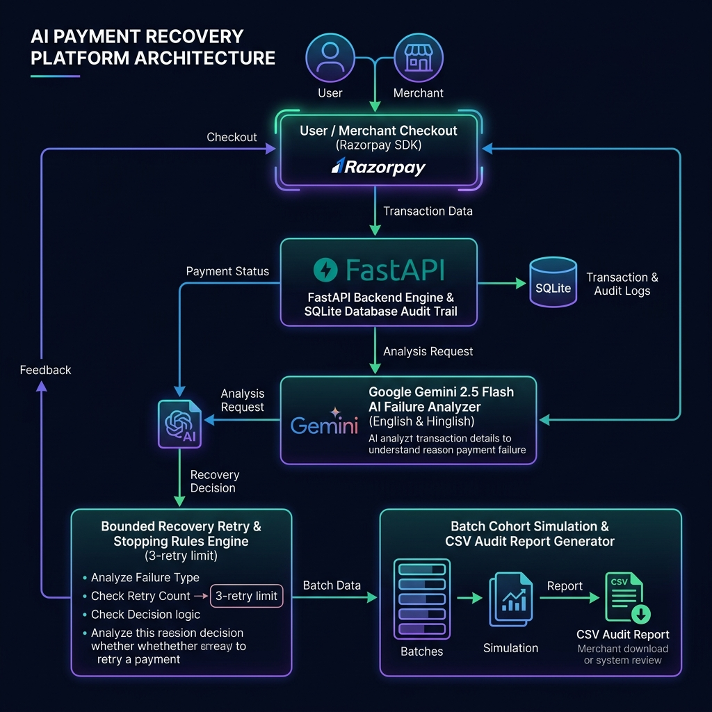
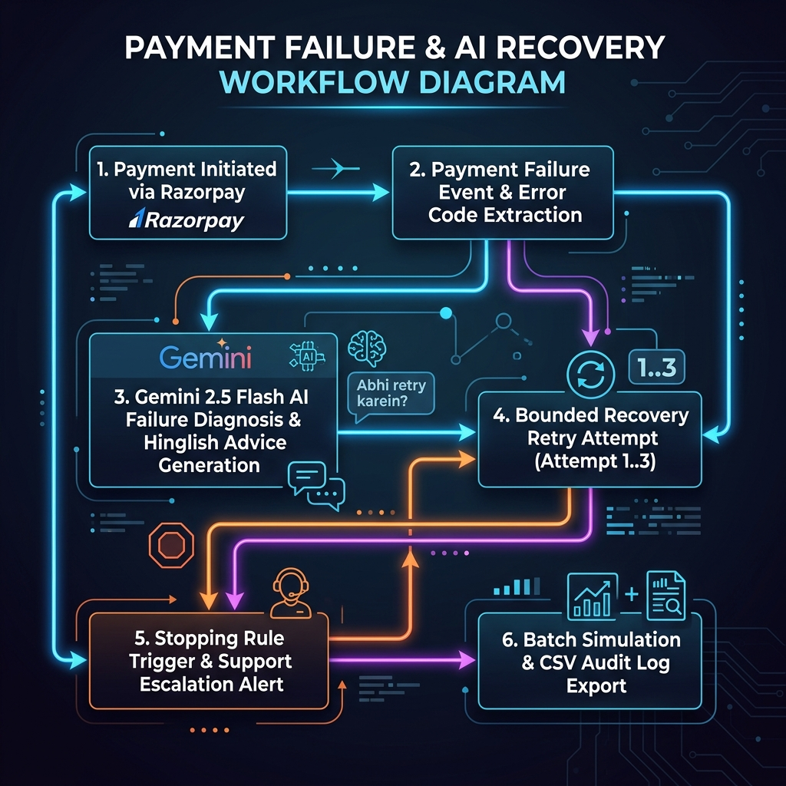

# 💳 AI Payment Recovery Engine

> **Razorpay AI Buildathon Submission — Track 03: AI Revenue Recovery**  
> *An intelligent payment degradation detection, AI-powered failure diagnosis, Hinglish user recovery intervention, bounded escalation stopping rule, and batch cohort analytics engine.*

---

## 📌 Table of Contents
- [🏛️ System Architecture](#️-system-architecture)
- [🔄 Workflow & Flowchart](#-workflow--flowchart)
- [🖥️ User Interface Preview](#️-user-interface-preview)
- [🚀 Features & Technical Implementation](#-features--technical-implementation)
- [🗄️ Database Schema & Data Model](#️-database-schema--data-model)
- [🔌 Complete API Reference](#-complete-api-reference)
- [⚡ Step-by-Step Setup & Execution](#-step-by-step-setup--execution)
- [📁 Project Folder Structure](#-project-folder-structure)
- [🏆 Alignment with Buildathon Criteria](#-alignment-with-buildathon-criteria)

---

## 🏛️ System Architecture

The AI Payment Recovery platform is designed as a modular, asynchronous web application. It connects the **Razorpay Checkout SDK** with **FastAPI**, **Google Gemini 2.5 Flash LLM**, and an **SQLite Audit Trail Database**.



### Core Architectural Layers:
1. **Presentation Layer (Frontend):** Pure HTML5 template (`templates/index.html`), custom CSS (`static/css/style.css`), and modular JavaScript (`static/js/script.js`). Interacts directly with Razorpay JS SDK.
2. **Application Layer (FastAPI Backend):** Handles order generation, signature verification, payment failure ingestion, recovery strategy routing, cohort simulation, and CSV audit streaming.
3. **Intelligence Layer (Google Gemini 2.5 Flash API):** Analyzes raw payment failure descriptions in real time, returning failure classifications, severity ratings, and localized Hinglish + English user recommendations.
4. **Data & Audit Layer (SQLite Database):** Stores immutable audit logs, linking original failed orders to successful recovery orders (`recovery_of_order_id`), timestamps (`recovered_at`), and support escalation flags (`escalated`).

---

## 🔄 Workflow & Flowchart

The following flowchart illustrates the step-by-step lifecycle of a payment transaction—from initial creation and failure degradation to AI diagnosis, bounded recovery retries, stopping rules, and audit trail export.



### Step-by-Step Execution Flow:

```text
[1. User Initiates Payment] 
          │
          ▼
[2. Payment Degradation / Failure Event]
          │
          ▼
[3. Ingest Error Code & Payload in Backend]
          │
          ▼
[4. Google Gemini 2.5 Flash Failure Analysis]
     ├── Classifies Failure (e.g., INSUFFICIENT_BALANCE)
     ├── Assigns Severity (LOW / MEDIUM / HIGH / URGENT)
     └── Generates Actionable English & Friendly Hinglish Advice
          │
          ▼
[5. Render Recovery Card & Recommendation]
          │
          ▼
[6. Customer Attempts Retry] ───► (Retry Count < 3) ──► Re-initiates Razorpay Order linked via `recovery_of_order_id`
          │
          ▼ (Retry Count >= 3)
[7. Bounded Stopping Rule Triggered]
     ├── Disable "Retry Payment" Button
     ├── Mark Order as Escalated in DB
     └── Display Support Escalation Alert ⚠️
```

---

## 🖥️ User Interface Preview

Below is a live screenshot of the web dashboard running in the browser, showing the real-time statistics cards, test payment form, payment recovery action card, payment history log, and failure analytics breakdown:


---

## 🚀 Features & Technical Implementation

### 1. Real-time AI Failure Diagnosis (Google Gemini 2.5 Flash) 🧠
- Sends raw payment error descriptions to Google's **Gemini 2.5 Flash model** via REST API.
- Generates localized Hinglish advice so users in India understand exactly what happened in conversational terms:
  - *Example:* `"Apne bank account mein funds add karein aur phir se transaction try karein."`
- **Resilient Fallback:** If `GEMINI_API_KEY` is missing or unreachable, the system gracefully falls back to local rule-based pattern matching without crashing.

### 2. Bounded Recovery Retry & Stopping Rules 🛡️
- Buildathon compliance requires bounded recovery workflows to prevent infinite retry loops.
- The system counts retries per payment order chain. If **3 consecutive retries fail**:
  - The **Stopping Rule** activates automatically.
  - The UI button changes to `Escalated to Support` and is disabled.
  - A red warning box alerts the user: `⚠️ Max retry limit reached. Escalated to Customer Support.`

### 3. Batch Cohort Simulation (`/simulate-batch`) 📊
- Demonstrates money recovery performance across a cohort of transactions.
- Clicking **"Run Batch Simulation"** generates 10 mock payment failures (bank declined, insufficient funds, network timeout, etc.), recovers 40% of them, and dynamically updates the recovery statistics dashboard.

### 4. Audit Trail & CSV Export (`/export-audit`) 📄
- Maintains a compliant audit trail in SQLite (`payments` table) tracking:
  - `order_id`, `payment_id`, `amount`, `status`, `failure_reason`, `recovery_of_order_id`, `recovered_at`, `escalated`, `recommendation_en`, and `recommendation_hinglish`.
- Clicking **"Export Audit Trail (CSV)"** streams a raw CSV file directly for audit compliance and financial reconciliation.

---

## 🗄️ Database Schema & Data Model

The application uses an SQLite database (`payment.db`) with dynamic schema migration:

```sql
CREATE TABLE payments (
    id INTEGER PRIMARY KEY AUTOINCREMENT,
    order_id TEXT UNIQUE,
    payment_id TEXT,
    amount REAL NOT NULL,
    currency TEXT DEFAULT 'INR',
    status TEXT NOT NULL,                  -- 'CREATED', 'SUCCESS', 'FAILED', 'RECOVERED'
    failure_reason TEXT,
    recovery_of_order_id TEXT,             -- Links recovery payment back to original failed order_id
    recovered_at TEXT,                     -- ISO timestamp of recovery
    escalated INTEGER DEFAULT 0,          -- 1 if stopping rule triggered support escalation
    recommendation_en TEXT,               -- AI-generated English advice
    recommendation_hinglish TEXT,         -- AI-generated Hinglish advice
    created_at TEXT NOT NULL,
    updated_at TEXT NOT NULL
);
```

---

## 🔌 Complete API Reference

### 1. Create Payment Order
- **Endpoint:** `POST /create-order`
- **Request Body:**
  ```json
  {
    "amount": 500.00,
    "recovery_of_order_id": null
  }
  ```
- **Response:**
  ```json
  {
    "success": true,
    "order_id": "order_TUkm067x8eqOzW",
    "amount": 50000,
    "currency": "INR",
    "key_id": "rzp_test_TSk0Ge6qiz5Q4C"
  }
  ```

### 2. Analyze Payment Failure (Gemini AI)
- **Endpoint:** `POST /analyze-failure`
- **Request Body:**
  ```json
  {
    "razorpay_order_id": "order_TUkm067x8eqOzW",
    "error_description": "Bank account has insufficient balance",
    "error_code": "BAD_REQUEST_ERROR"
  }
  ```
- **Response:**
  ```json
  {
    "success": true,
    "order_id": "order_TUkm067x8eqOzW",
    "status": "FAILED",
    "category": "INSUFFICIENT_BALANCE",
    "severity": "HIGH",
    "recommendation": "Ask customer to use another account or payment method.",
    "recommendation_hinglish": "Apne bank account mein funds add karein aur phir se transaction try karein."
  }
  ```

### 3. Run Batch Cohort Simulation
- **Endpoint:** `POST /simulate-batch`
- **Response:**
  ```json
  {
    "success": true,
    "message": "Successfully simulated 10 payment recovery cohort cases."
  }
  ```

### 4. Export Audit Trail CSV
- **Endpoint:** `GET /export-audit`
- **Response:** Content-Type `text/csv` attachment file download.

---

## ⚡ Step-by-Step Setup & Execution

### Step 1: Clone Repository
```bash
git clone https://github.com/your-username/AI_Payment_Recovery.git
cd AI_Payment_Recovery
```

### Step 2: Set Up Virtual Environment
```bash
# Windows
python -m venv venv
venv\Scripts\activate

# macOS / Linux
python3 -m venv venv
source venv/bin/activate
```

### Step 3: Install Dependencies
```bash
pip install -r requirements.txt
```

### Step 4: Configure `.env` File
Copy `.env.example` to `.env` and fill in your keys:
```bash
cp .env.example .env
```
Edit `.env`:
```env
RAZORPAY_KEY_ID=rzp_test_TSk0Ge6qiz5Q4C
RAZORPAY_KEY_SECRET=w0P1PwD9mN6zLOf0Fw0x5fhi
GEMINI_API_KEY=your_gemini_api_key_here
```

### Step 5: Launch FastAPI Server
```bash
uvicorn main:app --reload
```
Open your browser and navigate to: **`http://127.0.0.1:8000`**

---

## 📁 Project Folder Structure

```text
AI_Payment_Recovery/
├── static/
│   ├── css/
│   │   └── style.css              # Custom styling, dark tokens, badges & responsive cards
│   └── js/
│       └── script.js              # Payment flow, SDK modals, Gemini parsing & stopping rules
├── templates/
│   └── index.html                 # Clean HTML5 layout & dashboard structure
├── main.py                        # FastAPI backend, Gemini AI client & SQLite audit engine
├── architecture_diagram.png       # Visual System Architecture Diagram
├── workflow_flowchart.png         # Visual Payment & Recovery Workflow Flowchart
├── payment_recovery_ui.png        # Live UI Screenshot
├── step_by_step_migration.md      # Refactoring and migration log
├── .env.example                   # Environment configuration template
├── .gitignore                     # Git exclusion rules
├── requirements.txt               # Dependencies list
└── README.md                      # Comprehensive project documentation
```

---

## 🏆 Alignment with Buildathon Criteria

| Buildathon Bar Requirement | Implementation in AI Payment Recovery |
| :--- | :--- |
| **Track 03 — AI Revenue Recovery** | Detects payment degradation, diagnoses failure, determines intervention, and recovers lost money. |
| **Real AI Usage** | Uses **Google Gemini 2.5 Flash** for intelligent error analysis and Hinglish user guidance. |
| **Bounded Recovery & Stopping Rules** | Tracks retries; enforces a strict **3-retry stopping rule** with support escalation. |
| **Measured Money Recovered Across a Batch** | Features a `/simulate-batch` endpoint demonstrating cohort recovery rates on dashboard. |
| **Complete Audit Trail** | Stores full database transition logs exportable via `/export-audit` as a CSV report. |

---

## 📄 License
Distributed under the MIT License. See `LICENSE` for details.
