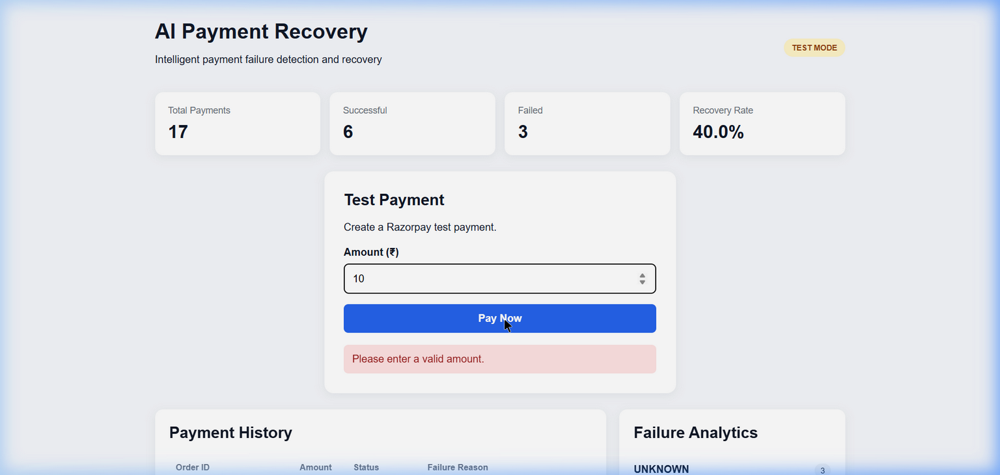

# Step-by-Step Refactoring Report: Separating HTML, CSS, and JavaScript

This document outlines the step-by-step process followed to clean up the monolithic template `templates/index.html` by separating it into clean HTML structure, external CSS styling, and external JavaScript logic, and mounting static asset routes in FastAPI.

---

## 📋 Executive Summary
Originally, the project had all frontend code (HTML structure, CSS layout, and JavaScript application logic) inside a single large file `templates/index.html` (~1,900 lines). We successfully split this into three modular files and configured FastAPI to serve static files.

---

## 🛠️ Step-by-Step Process

### **Step 1: Code Base Analysis**
1. Analyzed the contents of `templates/index.html` and identified the `<style>` block (lines 14 to 328) and the `<script>` block (lines 678 to 1888).
2. Checked `main.py` to see how FastAPI serves the app, confirming that there was no existing static file route configuration.

---

### **Step 2: CSS Separation**
1. Created the static assets directory structure: `static/css/`.
2. Created a new stylesheet file: `static/css/style.css`.
3. Moved all CSS rules verbatim from `templates/index.html` to the stylesheet.

---

### **Step 3: JavaScript Separation**
1. Created the static assets directory structure: `static/js/`.
2. Created a new script file: `static/js/script.js`.
3. Moved all payment flows, Razorpay SDK handlers, dashboard rendering, failure category checks, and UI helper functions from the template into `static/js/script.js`.

---

### **Step 4: HTML Template Refactoring**
1. Cleaned up `templates/index.html` by removing all inline CSS (inside `<style>`) and inline JS (inside `<script>`).
2. Inserted clean reference links in the `<head>` and `<body>` tags:
   - **For CSS:** `<link rel="stylesheet" href="/static/css/style.css">`
   - **For JS:** `<script src="/static/js/script.js"></script>`

---

### **Step 5: Backend Route Update (FastAPI)**
1. Opened `main.py` and imported `StaticFiles` from `fastapi.staticfiles`.
2. Mounted the static directory to allow serving stylesheet and script files from the backend:
   ```python
   from fastapi.staticfiles import StaticFiles

   app.mount("/static", StaticFiles(directory="static"), name="static")
   ```

---

### **Step 6: Documentation Update**
1. Modified `README.md` to reflect the updated file layout under the `## 📁 Project Structure` section so that future developers see the new file tree format:
   ```text
   AI_Payment_Recovery/
   │
   ├── static/
   │   ├── css/
   │   │   └── style.css
   │   └── js/
   │       └── script.js
   │
   ├── templates/
   │   └── index.html
   │
   └── main.py
   ```

---

## 🔍 Verification & Visuals

We ran the server locally using a dynamic port:
```bash
venv\Scripts\python.exe -m uvicorn main:app --port 0
```
This started the FastAPI server successfully. The static assets loaded with status code `200 OK`.

Here is the visual screenshot of the application running with the styles and JavaScript working perfectly:


